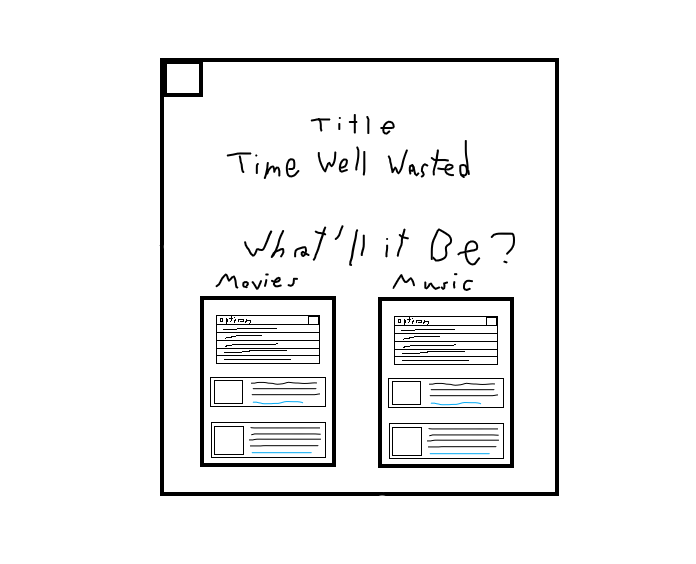

# Time-Well-Wasted

## Who are we building this for?
Bored people.
​
## What is the user trying to achieve?
A platform to get recommondations on music, movies, games, and recipes, and others (pending approval) based off a user's preferences
​
​
## Why do they want to achieve this?
Gives the user suggestions for entertainment whenever they feel like.
​
## Name
Time Well Wasted
​
## What its going to be
Generate a list based off of tastes that the user will fill out in a form
​
## Wireframe
foundation

​
## APIs
Spotify
TMDB
​
## Assignments
Front End - Henry Parrish  
Front End - Kahlil Goldstein  
Back End Spotify API - Nader Mashy  
Back End TMDB API - Eric LaFontsee  